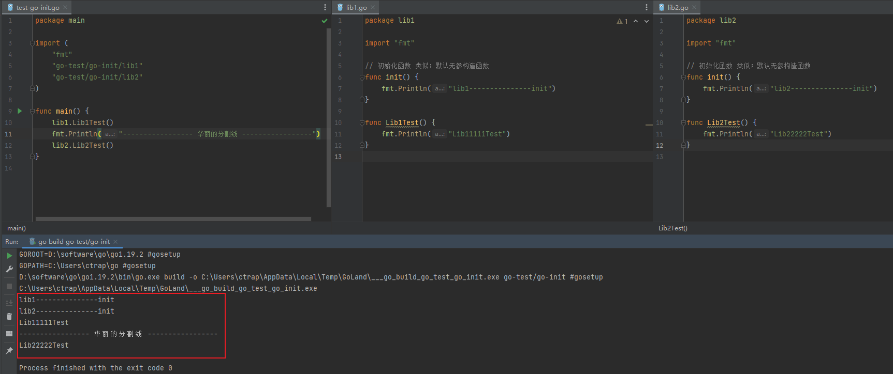
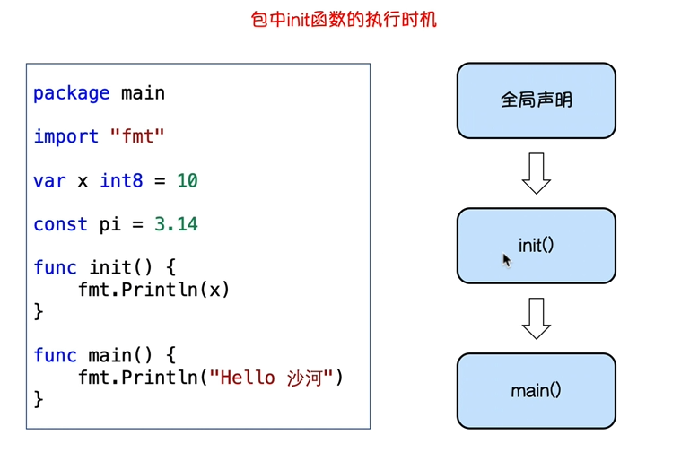
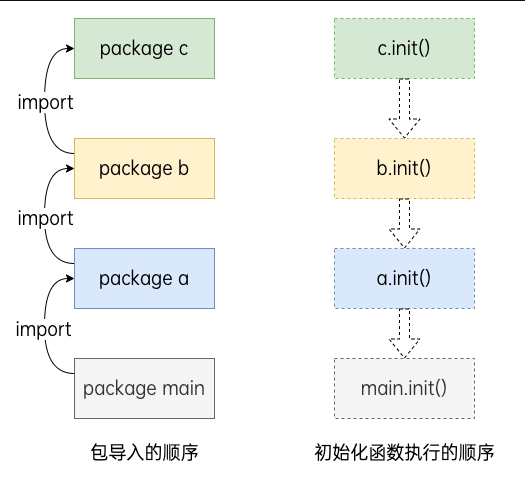

@[TOC](go-package 包管理)

# 01、go-package 包管理

> 可以参考文章：
> [包与依赖管理：https://www.liwenzhou.com/posts/Go/11-package/](https://www.liwenzhou.com/posts/Go/11-package/)


## 一、go init() 函数

### 1、go 在package内的init() 方法
这里在包下的init() 方法会被引入此包的时候优先执行
类似默认的无参构造函数（注意：在包内需要首字母小写）

全部代码如下图所示：



## 二、package 加载顺序

### 1、package 的加载顺序图



### 2、import 的加载顺序图


### 3、别名（匿名别名）


#### 3.1 匿名别名 _ （下划线）

lib3 代码如下：
```go
package lib3

import "fmt"

func init() {
	fmt.Println("lib3---------------init")
}
```

主函数代码如下：
```go
package main

import (
	_ "go-test/01-go-package/lib3" // 引入lib3，但是不使用，则前面加入 _ 作为匿名，然后会读取他的init()
)

func main() {
}
```

#### 3.2 别名 . （一个点）
最好轻易不要使用，会导致方法定义重名

主函数代码如下：
```go
package main

import (
	. "go-test/01-go-package/lib3" 
)

func main() {
}
```