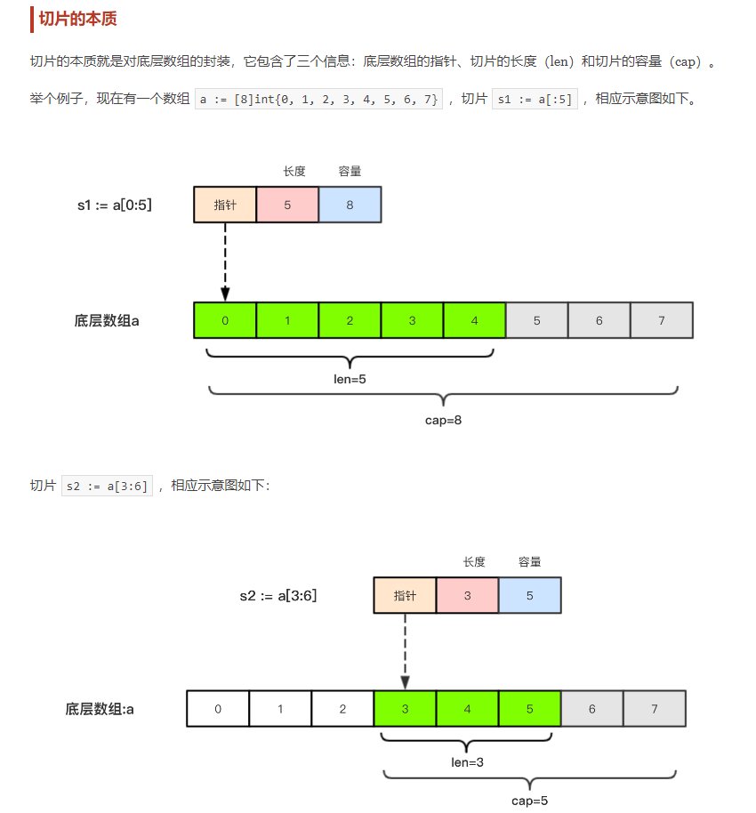

# go-variable

## 1、const-iota 常量&iota关键字

iota记住下面2点
- 遇见const关键字就置为0（所以只能在const内部使用）
- 每增加一行则iota的值顺次+1
- 注意：_为省略，但是会保留 iota+1的值

## 2、array和 slice 区别

区别：
- 1、切片是指针类型，数组是值类型；
- 2、数组的长度是固定的，而切片不是（切片可以看成动态的数组）；
- 3、切片比数组多一个容量（cap）属性；
- 4、切片的底层是数组。

